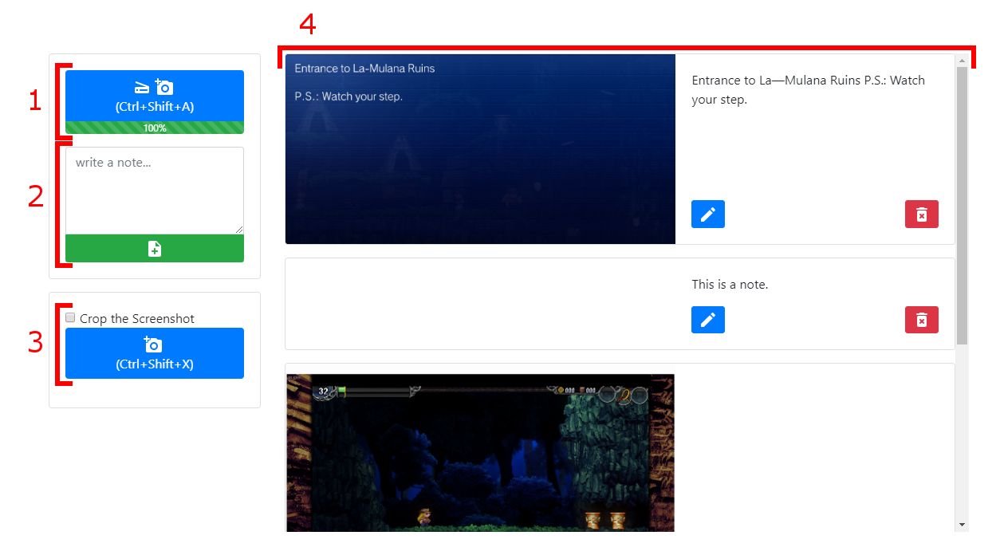
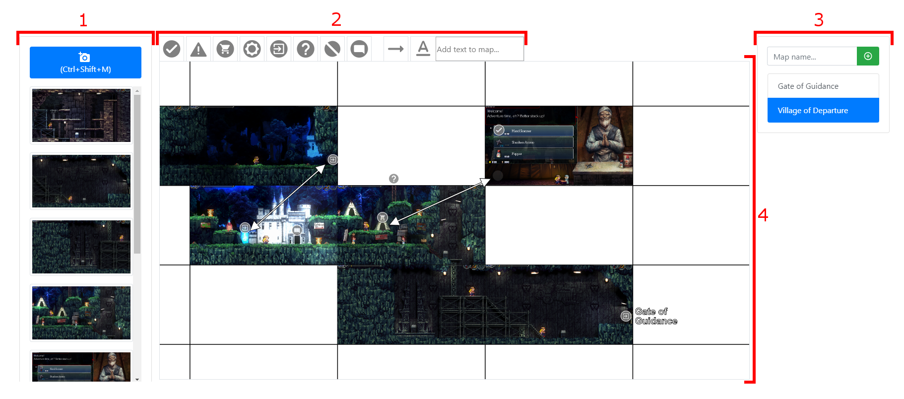

# LM2Notepad
Notepad application for La-Mulana 2.

Take screenshots, write notes and create maps while playing the game.

Made with:
- [Electron](https://electronjs.org/) : Framework
- [Konva](https://konvajs.org/) : Map canvas
- [Tesseract.js](https://github.com/naptha/tesseract.js) : Text scanning
- [Bootstrap](https://getbootstrap.com/) : Visual styling

## Note tool

:warning: La Mulana 2 window needs to be visible and selected from the captured window list before you can take screenshots.

#|Meaning|Action
-|-|-
1 | Scanner | Take and scan text from a screenshot and add it to notes
2 | Add a note | Add a new note
3 | Add a screenshot | Take and add a screenshot to notes, cropping removes borders from the screenshot
4 | Note list | View, edit and delete notes

## Mapping tool

:warning: La Mulana 2 window needs to be visible and selected from the captured window list before you can take screenshots.

#|Meaning|Action
-|-|-
1 | Screenshot list | Drag and drop images to map grid, right click to delete a screenshot
2 | Map tools | Drag and drop icons and text to map
3 | Map list | Add and select maps, right click to delete a map
4 | Map | Right click to delete elements. Zoom and move the map with mouse wheel
